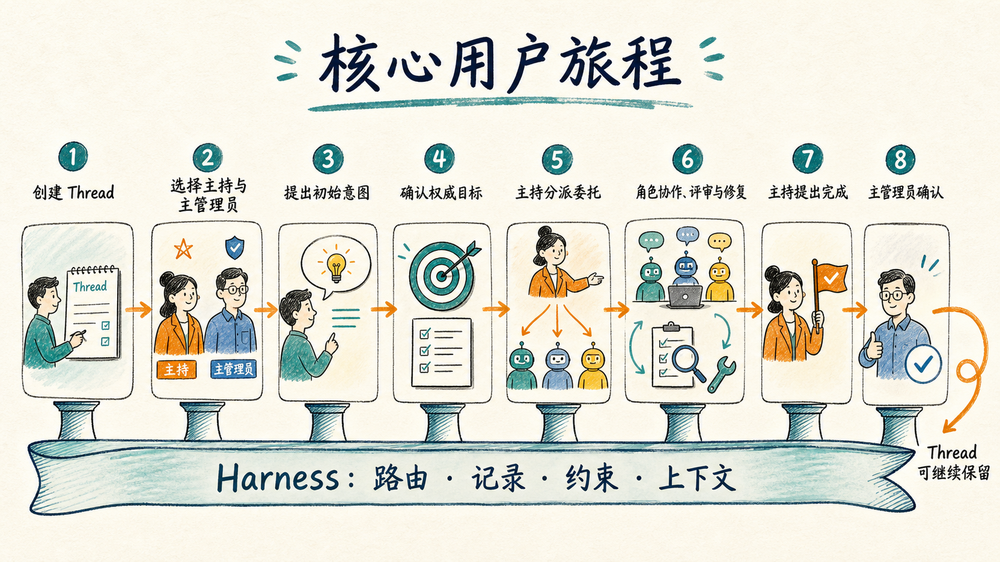
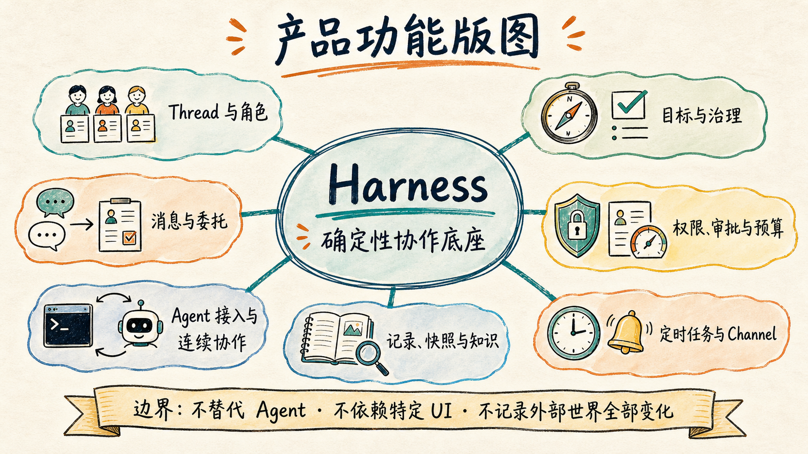

# Agent Orchestration

一个面向多 Agent 协作场景的编排 harness。它的首要目标不是再造一个 Agent，而是把 Codex CLI、Claude Code CLI 等已有 Agent 连接成可审计、可暂停、可恢复的协作流程，让用户从重复的任务分派、消息转发和进展整理中抽身，只在重要节点参与决策与签字。

## 当前阶段

项目已经完成长期、细粒度的 Dreaming 阶段，形成 Dreaming 0–54 的产品认识记录与阶段完成总结。目前尚未开启下一讨论阶段，也尚未进入版本范围、技术方案或功能实现；编程语言、运行时、存储方案和 UI 技术实现均未确定。

Dreaming 记录作为历史认识依据保留，但后续讨论不再延续 Dreaming 编号。新的讨论阶段将在真正开始时另行命名并约定目标；只有用户明确提出进入版本规划后，才开始讨论从 `v0.0.1` 起的具体迭代范围。

## 产品概览

### 核心用户旅程

### 产品功能版图

两张图是 Dreaming 核心成果的视觉摘要，为了可读性省略了部分条件与边界，不替代[Dreaming 阶段完成记录](docs/project-log/2026-08-31-dreaming-phase-completion.md)及其他正式文字记录。生成说明与完整提示词见[视觉番外](docs/project-log/2026-08-31-dreaming-visual-extras.md)。

## 长期愿景

- Harness 使用由平台用户提供和维护的 Agent 身份卡，包括名称、场景身份、性格、回复风格、发言权重、擅长方向、能力特征和调用方式；身份卡的评价与维护过程不属于 Harness 核心。
- 支持具备可靠程序化边界、能够持续交互并独立完成 Agent 级工作的 Agent；CLI 方向优先预设 Codex CLI 与 Claude Code CLI，但参与资格不取决于产品形态。
- 用户通过创建 thread 划定一段持续协作上下文；一个 thread 可以跨越多个连续权威目标，由附加唯一`主持`系统标签的 Agent 角色组织、推进并协调其他角色。
- Harness 负责角色间通信、结构化消息解析、外部动作执行、并发控制、检查点、定时任务和持久化。
- 用户通过用户身份卡产生用户角色并加入 thread；其中附加唯一`主管理员`系统标签的用户角色拥有目标确认、最高审批等治理权，其他用户角色也可以参与协作。
- 核心执行逻辑与前端 UI 解耦，通过稳定协议连接 Electrobun、Web、飞书、Telegram 等不同界面或渠道。
- 在一个 thread 内形成可交付的经验、知识和业务资料；跨 thread、跨项目管理属于未来可能的相邻产品。
- 未来可扩展到内容创作、数据分析、金融研究等非代码协作场景。

## 当前已确认的核心边界

- 不接入只提供图形界面、没有可靠程序化协作边界的 Agent，也不由 Harness 把裸模型补造成 Agent。
- Thread 事实由 Harness 承载，不归属于 Electrobun、Web 或其他具体 UI；当前尚未进入前端建设计划。
- 不把通用 DAG、固定开发阶段或复杂脑暴模式作为 Harness 的内置协作模型。
- 跨 thread 知识、项目组合管理、身份卡长期评价和多租户平台不属于当前 Harness 核心。
- 不默认执行提交、推送、创建 PR、部署等不可逆或外部可见动作。

## 项目记录

- [Dreaming 阶段完成记录](docs/project-log/2026-08-31-dreaming-phase-completion.md)：Dreaming 0–54 的完成依据、核心成果与后续问题分类。
- [Dreaming 核心成果视觉番外](docs/project-log/2026-08-31-dreaming-visual-extras.md)：核心用户旅程与产品功能版图的两张手绘概览图。
- [Dreaming 索引](docs/dreaming/README.md)：从核心问题到未来可能需求的完整阶段性思想成果。
- [Dreaming 0–53 主线审计](docs/project-log/2026-08-31-dreaming-0-53-mainline-audit.md)：当前核心闭环、支撑能力、外围职责与真实缺口的阶段性检查。
- [项目手记](CHANGELOG.md)：持续记录想法、方案、实现和方向变化。
- [立项记录](docs/project-log/2026-08-12-inception.md)：保存项目起点、核心痛点和最初设想。
- [延后设计线索](docs/project-log/deferred-design-ideas.md)：保存讨论中出现但尚未进入设计阶段的实现方向。
- [未来相邻产品想法](docs/project-log/future-product-ideas.md)：保存不属于当前 Harness 职责的独立产品方向。
- [架构与产品决策](docs/decisions/README.md)：记录经过讨论并确认的重要决定。
